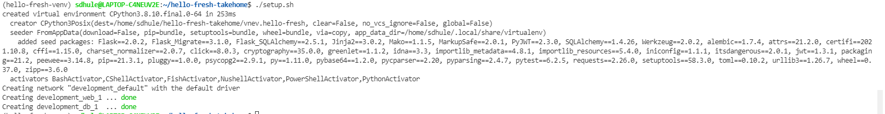

### Overview
Create a menu planning service which allows to manage weekly menu and associated recipies. 

#### Context
- A [weekly menu](https://www.hellofresh.com.au/plans/) contains a set of [recipies](https://www.hellofresh.com.au/recipes/). Each week different set of recipies are selected. See example [menu for this week](https://www.hellofresh.com.au/plans/).
- A [recipe](https://www.hellofresh.com.au/recipes/beef-veggie-ragu-spaghetti-5fa9c324cb8f8c0b3a183d01) contains ingredients, step-by-step instructions, nutirtional information, classification, and other metadata. See examples recipes here [1](https://www.hellofresh.com.au/recipes/southeast-asian-chicken-coconut-soup-5fa9c26209c8db59115d3f4f), [2](https://www.hellofresh.com.au/recipes/saucy-coconut-chicken-noodles-5f9b3c7198ecf4455b27d94d), [3](https://www.hellofresh.com.au/recipes/dukkah-roasted-sweet-potato-5f9b43847aacaa50f037d858).
- A customer can review weekly menu as well as recipe by assigning ratings and/or adding comments.

#### Tasks

1. Create data models using your selected ORM for weekly menu, recipe, ingredients, review, etc. Make sure these data models are appripriately connected using `FK`, `1:M`, `M:M ` relationships.
2. Create REST APIs to create, list, read, update, delete data model objects. Bonus if you can secure API using API tokens (recommended) or JWT tokens. You can use Google Authentication to obtain JWT token.
3. Create unit and E2E tests. For E2E API tests you can use [Postman](https://www.postman.com/) but ensure Postman collection are commited to your repository. For unit tests use a framework acccording to your stack.
4. Make sure your tests can be run from a single command - create test runner `makefile` or `bash` script to run your tests.

### Technology Stack
Python 3, Flask as web framework, PeeWee as ORM, Docker as Container, PostgreSQL as a database, Pytest for unit test, Postman for API test

### Features
Authorization using JWT
CRUD on all model items
Auto-setup of postgre and web-tier using docker
End to end testing using postman
Logging
Unit testing

### How to Run
Execute setup.sh which will set up all docker stack and bring up the environment.

.. code-block:: bash
    (hello-fresh-venv) sdhule@LAPTOP-C4NEUV2E:~/hello-fresh-takehome$ ./setup.sh 
    created virtual environment CPython3.8.10.final.0-64 in 265ms
    creator CPython3Posix(dest=/home/sdhule/hello-fresh-takehome/vnev.hello-fresh, clear=False, no_vcs_ignore=False, global=False)
    seeder FromAppData(download=False, pip=bundle, setuptools=bundle, wheel=bundle, via=copy, app_data_dir=/home/sdhule/.local/share/virtualenv)
        added seed packages: pip==21.3.1, setuptools==58.3.0, wheel==0.37.0
    activators BashActivator,CShellActivator,FishActivator,NushellActivator,PowerShellActivator,PythonActivator
    Collecting alembic
    Using cached alembic-1.7.4-py3-none-any.whl (209 kB)
    Collecting attrs
    Using cached attrs-21.2.0-py2.py3-none-any.whl (53 kB)
    Collecting certifi
    Using cached certifi-2021.10.8-py2.py3-none-any.whl (149 kB)
    Collecting cffi
    Using cached cffi-1.15.0-cp38-cp38-manylinux_2_12_x86_64.manylinux2010_x86_64.whl (446 kB)
    Collecting charset-normalizer
    Using cached charset_normalizer-2.0.7-py3-none-any.whl (38 kB)
    Collecting click
    Using cached click-8.0.3-py3-none-any.whl (97 kB)
    Collecting cryptography
    Using cached cryptography-35.0.0-cp36-abi3-manylinux_2_24_x86_64.whl (3.5 MB)
    Collecting Flask
    Using cached Flask-2.0.2-py3-none-any.whl (95 kB)
    Collecting Flask-Migrate
    Using cached Flask_Migrate-3.1.0-py3-none-any.whl (20 kB)
    Collecting Flask-SQLAlchemy
    Using cached Flask_SQLAlchemy-2.5.1-py2.py3-none-any.whl (17 kB)
    Collecting greenlet
    Using cached greenlet-1.1.2-cp38-cp38-manylinux_2_17_x86_64.manylinux2014_x86_64.whl (156 kB)
    Collecting idna
    Using cached idna-3.3-py3-none-any.whl (61 kB)
    Collecting importlib-metadata
    Using cached importlib_metadata-4.8.1-py3-none-any.whl (17 kB)
    Collecting importlib-resources
    Using cached importlib_resources-5.4.0-py3-none-any.whl (28 kB)
    Collecting iniconfig
    Using cached iniconfig-1.1.1-py2.py3-none-any.whl (5.0 kB)
    Collecting itsdangerous
    Using cached itsdangerous-2.0.1-py3-none-any.whl (18 kB)
    Collecting Jinja2
    Using cached Jinja2-3.0.2-py3-none-any.whl (133 kB)
    Collecting jwt
    Using cached jwt-1.3.1-py3-none-any.whl (18 kB)
    Collecting Mako
    Using cached Mako-1.1.5-py2.py3-none-any.whl (75 kB)
    Collecting MarkupSafe
    Using cached MarkupSafe-2.0.1-cp38-cp38-manylinux_2_5_x86_64.manylinux1_x86_64.manylinux_2_12_x86_64.manylinux2010_x86_64.whl (30 kB)
    Collecting packaging
    Using cached packaging-21.2-py3-none-any.whl (40 kB)
    Collecting peewee
    Using cached peewee-3.14.8-py3-none-any.whl
    Collecting pluggy
    Using cached pluggy-1.0.0-py2.py3-none-any.whl (13 kB)
    Collecting psycopg2
    Using cached psycopg2-2.9.1-cp38-cp38-linux_x86_64.whl
    Collecting py
    Using cached py-1.11.0-py2.py3-none-any.whl (98 kB)
    Collecting pybase64
    Using cached pybase64-1.2.0-cp38-cp38-manylinux_2_5_x86_64.manylinux1_x86_64.manylinux_2_17_x86_64.manylinux2014_x86_64.whl (171 kB)
    Collecting pycparser
    Using cached pycparser-2.20-py2.py3-none-any.whl (112 kB)
    Collecting PyJWT
    Using cached PyJWT-2.3.0-py3-none-any.whl (16 kB)
    Collecting pyparsing
    Downloading pyparsing-3.0.4-py3-none-any.whl (96 kB)
        |████████████████████████████████| 96 kB 505 kB/s            
    Collecting pytest
    Using cached pytest-6.2.5-py3-none-any.whl (280 kB)
    Collecting requests
    Using cached requests-2.26.0-py2.py3-none-any.whl (62 kB)
    Collecting SQLAlchemy
    Using cached SQLAlchemy-1.4.26-cp38-cp38-manylinux_2_5_x86_64.manylinux1_x86_64.manylinux_2_17_x86_64.manylinux2014_x86_64.whl (1.6 MB)
    Collecting toml
    Using cached toml-0.10.2-py2.py3-none-any.whl (16 kB)
    Collecting urllib3
    Using cached urllib3-1.26.7-py2.py3-none-any.whl (138 kB)
    Collecting Werkzeug
    Using cached Werkzeug-2.0.2-py3-none-any.whl (288 kB)
    Collecting zipp
    Using cached zipp-3.6.0-py3-none-any.whl (5.3 kB)
    Collecting pyparsing
    Using cached pyparsing-2.4.7-py2.py3-none-any.whl (67 kB)
    Installing collected packages: MarkupSafe, zipp, Werkzeug, pycparser, Jinja2, itsdangerous, greenlet, click, SQLAlchemy, pyparsing, Mako, importlib-resources, importlib-metadata, Flask, cffi, urllib3, toml, py, pluggy, packaging, iniconfig, idna, Flask-SQLAlchemy, cryptography, charset-normalizer, certifi, attrs, alembic, requests, pytest, PyJWT, pybase64, psycopg2, peewee, jwt, Flask-Migrate
    Successfully installed Flask-2.0.2 Flask-Migrate-3.1.0 Flask-SQLAlchemy-2.5.1 Jinja2-3.0.2 Mako-1.1.5 MarkupSafe-2.0.1 PyJWT-2.3.0 SQLAlchemy-1.4.26 Werkzeug-2.0.2 alembic-1.7.4 attrs-21.2.0 certifi-2021.10.8 cffi-1.15.0 charset-normalizer-2.0.7 click-8.0.3 cryptography-35.0.0 greenlet-1.1.2 idna-3.3 importlib-metadata-4.8.1 importlib-resources-5.4.0 iniconfig-1.1.1 itsdangerous-2.0.1 jwt-1.3.1 packaging-21.2 peewee-3.14.8 pluggy-1.0.0 psycopg2-2.9.1 py-1.11.0 pybase64-1.2.0 pycparser-2.20 pyparsing-2.4.7 pytest-6.2.5 requests-2.26.0 toml-0.10.2 urllib3-1.26.7 zipp-3.6.0
    Creating network "development_default" with the default driver
    Creating development_db_1  ... done
    Creating development_web_1 ... done

### API Testing
API documentation is published on postman https://documenter.getpostman.com/view/7952247/UVC2HoyV

